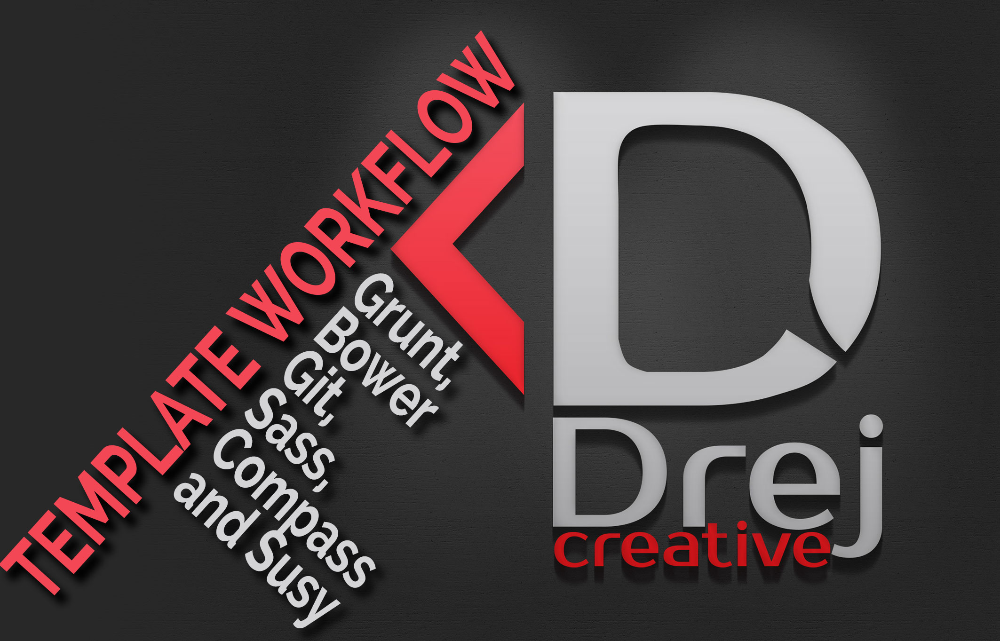

# Template for my Grunt workflow with Bower, Git, Sass, Compass

This is my template for simple Grunt workflow with Bower, Git, Sass and Compass. This template give you few thing. First, grunt with compass addon compile your Sass into css, then automatically minify your javascripts, then give you livereload of your web project in browser. Bower give you simple way to include any of front end framework with one click.

##Instructions

Make sure you have these installed
	1. [node.js](http://nodejs.org/)
	2. [git](http://git-scm.com/)
	3. [gruntjs](http://gruntjs.com/)
	4. [bower](http://bower.io)

Clone this repository into your local machine using the terminal (mac) or Gitbash (PC) `> git clone https://github.com/drejcreative/GruntBowerSassWorkflow.git`

Install grunt.js via the Mac terminal or Gitbash on a PC > `npm install -g grunt-cli`

CD to the folder with workflows `cd GruntBowerSassWorkflow`

Run `> npm install` to install the project dependencies

Run `> bower install` to install the project dependencies

 Run `> grunt` command to start the automation

And open index.html in your browser and you are set to go
